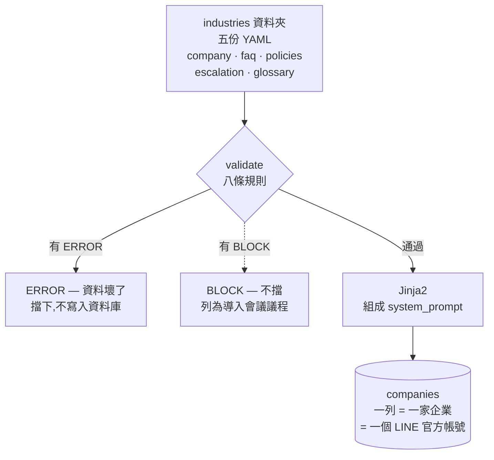
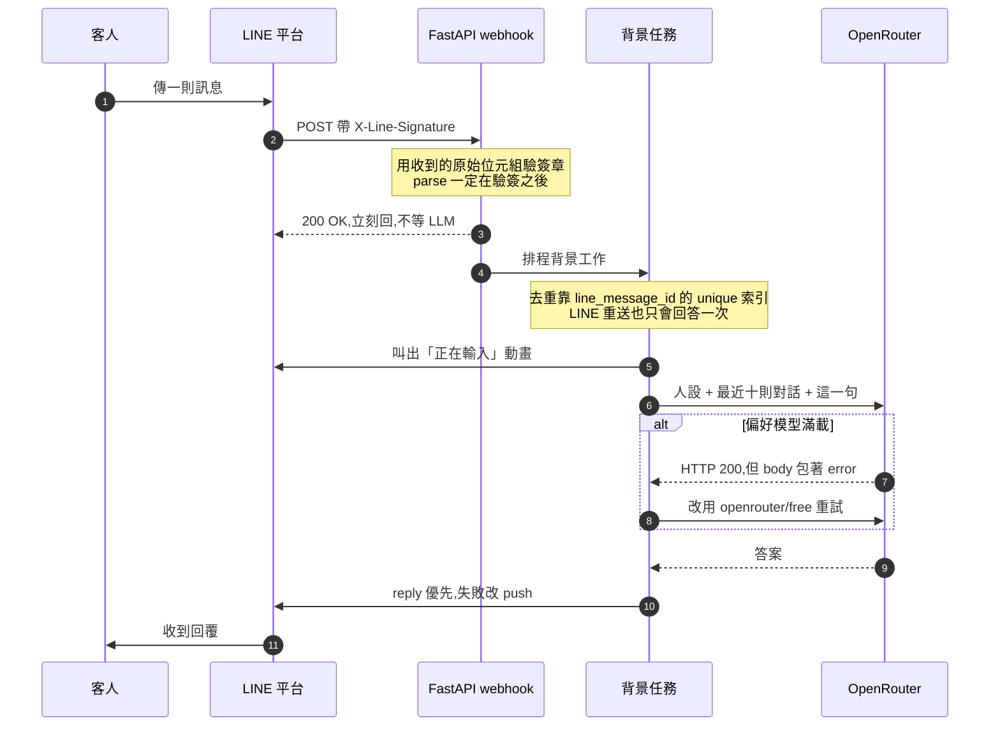
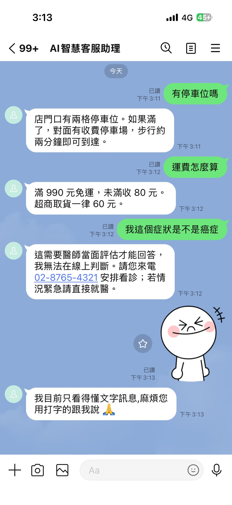

# AI 智慧客服(萬用)

[](https://github.com/inform199751-crypto/universal-ai-helpdesk/actions/workflows/ci.yml)

> Universal AI Helpdesk — 企業把自己的資料放進一個資料夾,不改任何一行程式碼,
> 就得到一個掛在 LINE 官方帳號上的 AI 客服。


影片中間唯一發生的事:

```bash
python -m app.cli seed --industry clinic --slug bistro --reset-history
```

**沒有重啟服務、沒有改任何一行程式碼、LINE Console 的設定也沒動。**
上一則它還是餐酒館,下一則它已經知道自己不該回答醫療問題。

### 導入時:資料進系統(一家企業只做一次)



### 執行時:每一則客人訊息



**為什麼 webhook 要立刻回 200 再做事:** LINE 沒收到 2xx 就會重送,而 LLM 要跑
三到十五秒 —— 同步等一定超時,客人會收到兩次一樣的答案。

換行業 = 複製一個資料夾、改裡面的 YAML、重新 seed。**沒有任何一行 per-company 的程式碼。**

## 三個示範行業



**同一個帳號、同一個對話框、四分鐘內。** 3:11 它是餐酒館,3:12 變成電商,
3:12 又變成診所並拒答醫療問題,3:13 收到貼圖時知道自己看不懂非文字訊息。
中間只跑過兩次 `seed`,程式碼一行沒動。


| 行業 | 它壓測到什麼 |
|---|---|
| 餐飲 | 基準線 |
| 電商 | 退換貨、物流、付款這類規則密集的問答 |
| 診所 | 高風險場域 —— 不能給醫療建議、必須轉真人 |

## 這個專案真正的主張

不是「我用 AI 做了一個聊天機器人」,而是:

1. **換行業只換資料。** 行業是參數,不是寫死的邏輯。
2. **交付的不是機器人,是一份導入檢查清單。** `validate` 跳出來的每一條 BLOCK,
   都是導入會議上要跟客戶確認的問題 —— 不是 bug。
3. **沉默是唯一不被接受的失敗模式。** LLM 掛了、網路斷了、token 過期了,
   客人都要收到一句得體的話。

## 技術棧

FastAPI · SQLAlchemy · PostgreSQL / SQLite · Alembic · LINE Messaging API · OpenRouter

## 怎麼跑起來

```bash
pip install -e ".[dev]"
cp .env.example .env        # 填 FERNET_KEY 與 OPENROUTER_API_KEY
alembic upgrade head
python -m app.cli seed --industry restaurant --slug bistro \n    --channel-secret <LINE Channel Secret> --channel-token <LINE Access Token>
python scripts/dev.py --slug bistro   # 起服務 + Tunnel,並自動寫回 LINE Console
```

Quick Tunnel 的網址每次重啟都會變,`--slug` 會讓腳本自己把當次的網址 PUT 回
LINE,不必手動貼、也不必按 Verify。不帶 `--slug` 就只印網址,自己去填。

換行業(不必再給憑證,也不必重啟服務):

```bash
python -m app.cli seed --industry ecommerce --slug bistro --reset-history
python -m app.cli seed --industry clinic    --slug bistro --reset-history
```


Demo 前請照 [docs/demo-checklist.md](docs/demo-checklist.md) 跑一遍。

## 狀態

**v1 完成,已經接在真的 LINE 官方帳號上跑過。** 自動測試全綠 —— 數量與執行結果見上方的 CI badge,每次 push 都會在 Python 3.11 與 3.13 上重跑。

真機驗證過的行為:

- 三個行業各自答出自己的內容 —— 同一個帳號、同一個 webhook,只換資料夾
- 短期記憶跨訊息成立(第二句沒提店名,它知道在講同一家店)
- L3 升級時逐字照著 `escalation.yaml` 的話術走,沒有自己發揮
- 診所版拒答病情,而且回覆裡不出現自己的禁語「診斷」
- 傳圖片回固定話術,不浪費一次 LLM 呼叫
- 上游模型滿載時自動換一個模型重試,客人不會看到錯誤訊息

- **專題報告(先看這份):[docs/report.md](docs/report.md)**
- 實作計畫:[docs/superpowers/plans/2026-09-21-helpdesk-v1.md](docs/superpowers/plans/2026-09-21-helpdesk-v1.md)
- 系統設計:[docs/superpowers/specs/2026-09-21-design.md](docs/superpowers/specs/2026-09-21-design.md)
- 資料庫設計:[docs/superpowers/specs/2026-09-21-schema-draft.md](docs/superpowers/specs/2026-09-21-schema-draft.md)
- Demo 流程:[docs/demo-checklist.md](docs/demo-checklist.md)

## 下一步

| 要做什麼 | 為什麼是下一個 |
|---|---|
| **RAG 與知識庫** | 現在整份知識庫是塞進 system prompt 的,每則請求實測 1500-2300 tokens。12 筆 FAQ 沒問題,**200 筆塞不進去**。`knowledge_documents` 資料表與 `companies.vector_collection` 欄位在設計階段就預留了(決策 7:一家一個 collection,不是同一個 collection 用 `company_id` 過濾 —— 過濾法只要有一次忘記加 filter,就會把別家公司的文件回給客人,而且不會報錯)。 |
| **Tool Calling** | 訂位這類要存狀態的動作。帳單計算不需要,純計算沒有外部依賴。 |
| **真人接管** | `users.mode`、`users.mode_expires_at`、`companies.human_mode_timeout_minutes` 已預留,含「客服下班忘記切回 AI,那位客人就永遠等不到回覆」的逾時自動歸還。先做機制,後台介面之後再說。 |

## 命名說明

顯示名稱是「AI 智慧客服(萬用)」。目錄、repo 與部署服務名使用 `universal-ai-helpdesk` ——
多數 PaaS 的服務名只允許小寫英數與連字號,而中文網址貼給別人時會變成一長串百分號編碼。
